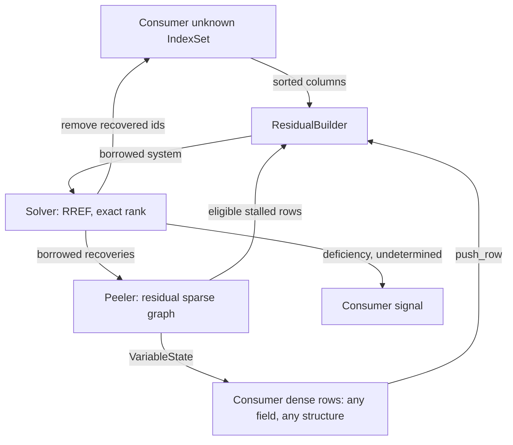

# Extraction map: `mix-dpc` → `sgraph`

Source revision `6d7d4ac`. Verdicts:

- **TAKE** — comes across essentially as-is (renaming aside).
- **LIFT** — the mechanism is right, the shape is wrong; specific generalization
  named.
- **LEAVE** — stays downstream in `mix-dpc` (or moves to `fff`).

## Sparse layer

| Item | Location | Verdict | Notes |
| --- | --- | --- | --- |
| `Ring<T>`, `Drain<'a,T>` | `internals/ring.rs:15,114` | **TAKE algorithm / LIFT boundary** → `sgraph::index` | Dense monotone slab over `VecDeque`; preserve front-drain recycling, but replace unchecked end arithmetic/casts, silent below-base `None`, and unlimited gap fill with checked span limits and retired/vacant distinction. Keep the differential test (`ring.rs:281`). |
| `IndexSet`, `BitIter` | `internals/ring.rs:131,258` | **TAKE algorithm / LIFT range** → `sgraph::index` | Bitmap set over a monotone `u64` range; preserve the `BTreeSet` differential (`ring.rs:305`). Current `range(lo, hi)` starts `iter()` at the set base and scans intervening bitmap words (`ring.rs:213-217`); implement direct word seeking with `O((hi-lo)/64 + output)` complexity and checked bounds. |
| `SplitMix64` incl. `below` | `rng.rs:15,38` | **TAKE algorithm / LIFT boundary** → `sgraph::rng` | Textbook SplitMix64; `below` is Lemire multiply-shift with unbiased rejection. Public `below` takes `NonZeroU32`, so `bound == 0` cannot reach the hot loop. |
| `distinct_offsets` (Floyd k-of-n) | `rng.rs:65` | **LIFT** | Change composition from `(seed, span, out)` to `(&mut SplitMix64, span, out)`. The checked public form returns `GraphError` for `out.len() > span`/conversion overflow before touching `out`; generators use a validated private kernel. Keep a seeded convenience wrapper. **Constraint:** output is identical for the constant-degree path — see charter invariant 2. |
| `neighbor_seed` / `NEIGHBOR_DOMAIN` | `rng.rs:9,55` | **LIFT** | One global XOR mask cannot serve a shared crate. Domain separation becomes a caller-supplied constant on the generator, because seed derivation is a wire-compatibility decision. `sgraph` supplies the mixing, the consumer supplies the domain. |
| Peeling core: reduce-at-ingest + `waiting` reverse adjacency + permissive LIFO ripple + `drive_peel` cascade | `internals/ldpc/decoder.rs:21-27,313-372` | **TAKE (algorithm) / LIFT (shape)** | This is the crate's centrepiece and is textbook LT/Raptor/LDPC-erasure peeling with no window semantics *in the algorithm*. See "what must change" below. |
| Buffer & key-list pooling: `pool`, `pool_cap`, `key_pool`, `take_keys`, `recycle_keys`, `take_recycled` | `decoder.rs:50,54,58,87,95,116` | **TAKE** | The mechanism that earns zero-allocation. The `(262_144 / symbol_len).clamp(8, 256)` heuristic (`decoder.rs:81`) becomes a configurable knob with that as the default. |
| Counters `known_count` / `repair_count` / `unresolved` | `decoder.rs:36,40,48` | **TAKE** | `unresolved` is what makes stall detection `O(1)` (`has_unresolved`, `decoder.rs:160`); without it the driver would scan every row per ingest. |
| `unresolved_equations() -> impl Iterator<Item = (&[u64], &[u8])>` | `decoder.rs:150` | **LIFT** | The *seam* is right; the unit-coefficient GF(2) shape is not. Becomes an iterator over `(support, weights, rhs)` where the weight slice is a ZST slice in the binary case. |
| `push_source_owned` | `decoder.rs:179` | **LIFT** → public `learn(var, Vec<u8>)` + `learn_copy(var, &[u8])` | Owned ingest remains useful for transports. Solver recovery stays borrowed from reusable RREF scratch. `Resolver` uses a private resident/length-validated copy path, backed by the same recycled peeler buffers, so its error type remains solver-only and allocation-free once warm. |
| `SourceWindow` | `internals/ldpc/window.rs:8` | **LEAVE** | Encoder-side symbol ownership and block/sliding retention are consumer policy. Its release-mode `slot()` contract (`window.rs:62`) is not copied into `sgraph`; changing that private downstream API is a separate `mix-dpc` bug fix, not part of the extraction proof. |
| `LdpcEncoder` | `internals/ldpc/encoder.rs:14` | **LEAVE (loop) / TAKE (generator)** | The reusable guarantee is edge regeneration, supplied by `NeighborGen`. Accumulating `Σ wᵢ·symbolᵢ` and choosing a wire return type remain in the consumer; no `CheckBuilder` type is added until a second consumer demonstrates common policy. |
| `MAX_DC = 64` | `internals/ldpc/mod.rs:25` | **LIFT** | A hard-coded stack-scratch bound for a constant-degree graph. Becomes `DegreeDistribution::max_degree()`, which sizes a pooled neighbour buffer. |
| `PendingRepair::window_base` and the `retire_below` repair scan | `decoder.rs:27,283-297` | **LIFT** | Core retirement drops a row only while its **current residual support** still contains a variable below the horizon; a cached `min_var` is updated on support changes. Add explicit `retire_check(id)` as policy mechanism. During Phase 5, the `mix-dpc` adapter keeps `window_base` metadata and explicitly retires every check whose original window starts below its horizon, preserving source behaviour rather than silently improving recovery during extraction. |
| `RepairHeader`, `HEADER_LEN_LDPC` | `packet.rs:31,40` | **LEAVE** | Wire format. Note `internals/ldpc/mod.rs:19` currently does `pub use crate::packet::RepairHeader;` — the sparse layer imports a wire type, and `push_repair(header, data)` (`decoder.rs:190`) takes it. **This is the single most important coupling to sever.** |
| Sliding-window policy: `window_base`/`window_span` semantics, TTL-derived widths, transport-driven horizons, the window-occupancy degree cap `eff = dc.min(span)` | `encoder.rs:65`, `stream.rs` | **LEAVE** | Transport decisions. The *cap* survives inside `WindowedUniform` as that generator's own rule, not as a core concept. |
| `internals/ldpc/tests.rs` | whole file | **LEAVE (as tests) / TAKE (as template)** | Every test constructs `(sym, w, dc, rps)` windowed streams. Excellent shape — deterministic seeds, loss patterns a plausible bug would break — but not portable as-is. |

### What must change in the peeling decoder

1. `push_repair(header: RepairHeader, data: &[u8])` (`decoder.rs:190`) →
   `push_check(id: CheckId, edges: &Edges, data: &[u8])`, or
   `push_check_with(id, &G) where G: NeighborGen`. The wire type disappears from
   the signature.
2. `unknown: Vec<u64>` (`decoder.rs:23`) → parallel support/weight vectors, with
   `swap_remove` (`decoder.rs:331`) moving both in lockstep.
3. `drive_peel` (`decoder.rs:355-372`) currently asserts `variable == reduced`.
   Over GF(2^m) with a lone unknown of weight `c` the recovered value is
   `c⁻¹ · rhs`, so the peel step needs an in-place inverse scale. **There is no
   field inverse anywhere in the peeling path today** — this is the single most
   substantive change on the non-binary axis.
4. Core retirement stops depending on `window_base`; the Phase 5 compatibility
   adapter retains that policy metadata and calls `retire_check`.

## Dense / residual layer

| Item | Location | Verdict | Notes |
| --- | --- | --- | --- |
| `solver::Row<'a> { terms: &[(u64,u8)], rhs: &[u8] }` | `internals/solver.rs:24` | **TAKE (shape) / LIFT (impl)** | The borrowed-row shape is already right and is what keeps assembly copy-free. |
| `solver::Solution { recovered, deficiency, undetermined }` | `internals/solver.rs:32` | **LIFT** | `recovered: Vec<(u64, Vec<u8>)>` allocates a `Vec` per symbol (`solver.rs:138`). Keep recovered ids and pivot-row indices in reusable solver scratch and expose borrowed `(VarId, &[u8])` views until the next solve. |
| `solver::solve` (dense RREF over GF(256), exact rank, per-column determinedness) | `internals/solver.rs:42` | **TAKE (algorithm) / LIFT (allocation + validation)** | Full RREF, `rank = pivot_row`, `deficiency = n_cols − rank`, determinedness by single-nonzero-in-row. Flat row-major matrices specifically so the pivot row is borrowable via `split_at_mut` (`solver.rs:51-55,91-96`) — keep that. It becomes a scratch-owning `Solver<F>` over `Vec<F::Elem>`, validates packed-symbol geometry, and rejects a zero-coefficient/non-zero-RHS row as inconsistent. |
| `swap_rows` | `internals/solver.rs:145` | **TAKE** (private) | `split_at_mut` + `swap_with_slice`, no temp buffer. |
| `codec::RowScratch` + `term_slot` | `codec.rs:556,562` | **TAKE** → part of the residual builder | The reused term-list pool; the only thing keeping row assembly allocation-free. |
| `codec::build_rows` two-pass verbatim-filter-replay | `codec.rs:489-543` | **LIFT** | Pass 2 replays pass 1's admission filters verbatim and zips by position; the code documents this fragility itself (`codec.rs:521-523`). Replace with a single-pass **push** API: the consumer pushes rows into a builder, the builder owns dedup, column mapping, and scratch reuse. The *admission decision* (window bounds, spentness) stays downstream; the *assembly* comes here. |
| `codec::Decoder::resolve` peel↔solve alternation | `codec.rs:428-479` | **TAKE** → `sgraph` driver | "Solve, feed recovered columns back into peeling, re-peel, repeat until a solve yields nothing" is identical for LDPC/LT/Raptor. The surrounding `dirty`/`stale` gating is downstream ingest policy. |
| `StoredRow { rhs, folded: bitset, remaining }` progressive reduction | `internals/hdpc.rs:245-252` | **TAKE (as a primitive)** | Fold each column out exactly once instead of re-reducing from scratch per solve (`hdpc.rs:367-371` records that re-reducing dominated the loss path). Field- and structure-agnostic; worth hosting as a reusable dense-row type that consumers instantiate. |
| `internals/symbol.rs` (`xor_into`, `scale_xor_into`, `scale_xor_rows`, `scale_inplace`) | whole file | **LEAVE → already in `fff`** | All four are single-statement forwards to `fff::ops::{add_assign, mul_add, mul_add_scatter, mul_assign}` with `debug_assert`s. No independent logic. Re-hosting creates a second convention for the same operation. Its GF(256) conformance tests (textbook 0x11B oracle, `symbol.rs:51-65`) test `fff`'s dispatch and belong in `fff`. |
| `hdpc_coeff`, `coeff_block` (Cauchy MDS block) | `internals/hdpc.rs:58,64` | **LEAVE → `fff` or a dense-RS crate** | Pure field-matrix construction, zero graph content. |
| `GenLayout`, `min_gen_retain`, `GenSlot`, `HdpcEncoder`, `HdpcRowStore`, `HdpcRow` | `internals/hdpc.rs` | **LEAVE** | Generation tiling over a `u64` stream, overlapping strides, a retain ring that *is* the HARQ retransmission budget, horizon retirement. Every source in a generation neighbours every check — there is no sparse structure to serve. |
| `ConfigError` variants `ZeroWindowWidth`, `InvalidHdpcGeometry`, `GenStrideOutOfRange`, `GenRetainTooSmall` | `error.rs` | **LEAVE** | Window/generation specific. `sgraph`'s error enum keeps only degree, geometry, and index-domain concerns. |

## The seam, stated once

What a peeling engine hands out, knowing nothing about any dense layer:

1. `fn has_stalled(&self) -> bool` — `O(1)`, backed by the `unresolved` counter.
2. An iterator of `(support, weights, rhs)` per stalled row — support is the
   residual neighbours only; `rhs` is reduced against every known one.
3. `fn variable_state(&self, var: VarId) -> VariableState<'_>` distinguishes
   `Retired`, `Unknown`, and `Known(&[u8])`.
4. `fn drain_recovered_into(&mut self, out: &mut Vec<VarId>)`.

What it accepts back:

5. Public `learn_copy(var, &[u8]) -> Result<(), GraphError>` supports borrowed
   external output; `Resolver` uses the equivalent crate-private validated path.

The **global solve-column set does not belong to the peeler**. `mix-dpc` owns it
as `codec::missing` (`codec.rs:458`), and a lost variable can have no retained
sparse edge at all. The resolver therefore takes a caller-maintained `IndexSet`
of all unknown variables, snapshots it into reusable sorted-column scratch, and
removes peeled/solved ids. Inferring columns from stalled supports would make the
zero-sparse-row deficiency case incorrectly report zero.

That is the whole contract. Dense-row field, coefficient structure, generation
geometry, loss discovery, and retirement policy remain consumer-owned.

